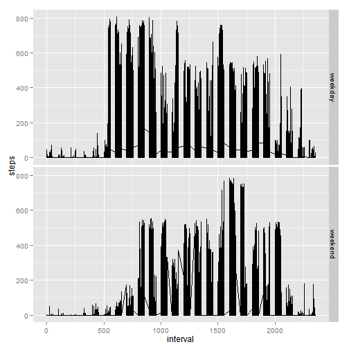

# Reproducible Research: Peer Assessment 1
---
author: "Perumal Kumar"  
date: "Sunday, August 17, 2014"  
output: html_document  
---


This is a document describing the activities required for Peer Assessment 1 part of Reproducible Research Course. 

This assignment makes use of data from a personal activity monitoring device. This device collects data at 5 minute intervals through out the day. The data consists of two months of data from an anonymous individual collected during the months of October and November, 2012 and include the number of steps taken in 5 minute intervals each day.

## Loading and preprocessing the data

```r
# Read the data from file 
activity <- read.csv("./activity.csv")

#convert the date field to date format
activity$date <-as.Date(activity$date)
```

## What is mean total number of steps taken per day?

Let us draw a histogram that shows the number of steps taken in a day

```r
library(ggplot2)
q1<- qplot(date,data=activity, xlab="DATE",ylab="Number of Steps") 
q1<- q1 + geom_histogram(aes(weight=activity$steps),binwidth=.5) 
q1<- q1 + scale_x_date()
q1
```

```
## stat_bin: binwidth defaulted to range/30. Use 'binwidth = x' to adjust this.
```

 


Let us look at the Mean and Median for the data. If we analyze the data we can look at mean in two ways.     

* consider also when steps is 0 in calculation and ignore NA steps   
* ignore all rows where steps is 0 and NA steps


Let us first analyze when we include rows steps is zero to find mean and median

```r
library(plyr)
summ_activity = ddply(activity,.(date),summarize, mean=mean(steps,na.rm=TRUE),median = median(steps,na.rm=TRUE),sum = sum(steps,na.rm=TRUE))
head(summ_activity,n=20)
```

```
##          date    mean median   sum
## 1  2012-10-01     NaN     NA     0
## 2  2012-10-02  0.4375      0   126
## 3  2012-10-03 39.4167      0 11352
## 4  2012-10-04 42.0694      0 12116
## 5  2012-10-05 46.1597      0 13294
## 6  2012-10-06 53.5417      0 15420
## 7  2012-10-07 38.2465      0 11015
## 8  2012-10-08     NaN     NA     0
## 9  2012-10-09 44.4826      0 12811
## 10 2012-10-10 34.3750      0  9900
## 11 2012-10-11 35.7778      0 10304
## 12 2012-10-12 60.3542      0 17382
## 13 2012-10-13 43.1458      0 12426
## 14 2012-10-14 52.4236      0 15098
## 15 2012-10-15 35.2049      0 10139
## 16 2012-10-16 52.3750      0 15084
## 17 2012-10-17 46.7083      0 13452
## 18 2012-10-18 34.9167      0 10056
## 19 2012-10-19 41.0729      0 11829
## 20 2012-10-20 36.0938      0 10395
```


Let us now analyze when we exclude rows with steps as zero to find mean and median

```r
library(plyr)
summ_activity1 = ddply(activity,.(date),summarize,mean=mean(steps[steps!=0],na.rm=TRUE),median = median(steps[steps!=0],na.rm=TRUE),sum = sum(steps,na.rm=TRUE))
head(summ_activity1,n=20)
```

```
##          date   mean median   sum
## 1  2012-10-01    NaN     NA     0
## 2  2012-10-02  63.00   63.0   126
## 3  2012-10-03 140.15   61.0 11352
## 4  2012-10-04 121.16   56.5 12116
## 5  2012-10-05 154.58   66.0 13294
## 6  2012-10-06 145.47   67.0 15420
## 7  2012-10-07 101.99   52.5 11015
## 8  2012-10-08    NaN     NA     0
## 9  2012-10-09 134.85   48.0 12811
## 10 2012-10-10  95.19   56.5  9900
## 11 2012-10-11 137.39   35.0 10304
## 12 2012-10-12 156.59   46.0 17382
## 13 2012-10-13 119.48   45.5 12426
## 14 2012-10-14 160.62   60.5 15098
## 15 2012-10-15 131.68   54.0 10139
## 16 2012-10-16 157.12   64.0 15084
## 17 2012-10-17 152.86   61.5 13452
## 18 2012-10-18 152.36   52.5 10056
## 19 2012-10-19 127.19   74.0 11829
## 20 2012-10-20 125.24   49.0 10395
```

We notice that Mean and Median changes with the assumption taken. 


## What is the average daily activity pattern?

Let us now look at the plot of average daily activity pattern from original data

let us first sumarize the average daily data and then plot it(ignoring steps as NA or 0)


```r
avg_activity = ddply(activity,.(interval),summarize,steps=round(mean(steps[steps!=0],na.rm=TRUE)),0)
                       
qplot(interval,steps, data=avg_activity,xlab="Intervals",ylab="Average Steps") + geom_line(breaks=avg_activity$intervals) + scale_y_continuous( limits = c(0,350), expand = c(0,0) )
```

```
## Warning: Removed 20 rows containing missing values (geom_point).
```

 

We notice that the average peaks up between interval 750 and 1000 let us narrow the plot


```r
qplot(interval,steps, data=avg_activity,xlab="Intervals",ylab="Average Steps") + geom_line(breaks=avg_activity$intervals) + scale_y_continuous( limits = c(0,350), expand = c(0,0) ) + scale_x_continuous(limits = c(750,1000))
```

```
## Warning: Removed 262 rows containing missing values (geom_point).
## Warning: Removed 261 rows containing missing values (geom_path).
```

 

We observe the maximum happens on interval 850 interval and the value is 352 from the table below


```r
summary(avg_activity)
```

```
##     interval        steps           0    
##  Min.   :   0   Min.   :  4   Min.   :0  
##  1st Qu.: 589   1st Qu.: 57   1st Qu.:0  
##  Median :1178   Median :104   Median :0  
##  Mean   :1178   Mean   :108   Mean   :0  
##  3rd Qu.:1766   3rd Qu.:142   3rd Qu.:0  
##  Max.   :2355   Max.   :352   Max.   :0  
##                 NA's   :19
```

## Imputing missing values

Let us look at the data from the original data to find the number of NA


```r
summary(activity)
```

```
##      steps            date               interval   
##  Min.   :  0.0   Min.   :2012-10-01   Min.   :   0  
##  1st Qu.:  0.0   1st Qu.:2012-10-16   1st Qu.: 589  
##  Median :  0.0   Median :2012-10-31   Median :1178  
##  Mean   : 37.4   Mean   :2012-10-31   Mean   :1178  
##  3rd Qu.: 12.0   3rd Qu.:2012-11-15   3rd Qu.:1766  
##  Max.   :806.0   Max.   :2012-11-30   Max.   :2355  
##  NA's   :2304
```

The data clearly shows a large number of NAs in total 2304 rows with NA values.

Let us now force the NA to have some values. 

When we look at the data it seems that there are certain days when there is no data captured. Let us therefore replace NA with the average of the steps for the interval across the data.


```r
activity_nona<-ddply(activity,.(interval),transform,steps=ifelse(is.na(steps),mean(steps,na.rm=TRUE),steps))
```


Let us now plot histogram of number of steps taken each day


```r
library(ggplot2)
q1<- qplot(date,data=activity_nona, xlab="DATE",ylab="Number of Steps") 
q1<- q1 + geom_histogram(aes(weight=activity$steps),binwidth=.5) 
q1<- q1 + scale_x_date()
suppressWarnings(print(q1))
```

```
## stat_bin: binwidth defaulted to range/30. Use 'binwidth = x' to adjust this.
```

 


The imputing of data has made the histogram smoother..

Let us also look at the summary information of data 


```r
summary(activity_nona)
```

```
##      steps            date               interval   
##  Min.   :  0.0   Min.   :2012-10-01   Min.   :   0  
##  1st Qu.:  0.0   1st Qu.:2012-10-16   1st Qu.: 589  
##  Median :  0.0   Median :2012-10-31   Median :1178  
##  Mean   : 37.4   Mean   :2012-10-31   Mean   :1178  
##  3rd Qu.: 27.0   3rd Qu.:2012-11-15   3rd Qu.:1766  
##  Max.   :806.0   Max.   :2012-11-30   Max.   :2355
```

We notice the Mean and Median do not change

Let us find Mean and Median for each day[exclude steps with 0]


```r
summ_activity2 = ddply(activity_nona,.(date),summarize,mean=mean(steps[steps!=0],na.rm=TRUE),median = median(steps[steps!=0],na.rm=TRUE),sum = sum(steps,na.rm=TRUE))
summary(summ_activity2)
```

```
##       date                 mean           median           sum       
##  Min.   :2012-10-01   Min.   : 20.5   Min.   : 20.5   Min.   :   41  
##  1st Qu.:2012-10-16   1st Qu.: 90.6   1st Qu.: 42.5   1st Qu.: 9819  
##  Median :2012-10-31   Median :125.2   Median : 54.5   Median :10766  
##  Mean   :2012-10-31   Mean   :118.0   Mean   : 54.0   Mean   :10766  
##  3rd Qu.:2012-11-15   3rd Qu.:152.9   3rd Qu.: 61.5   3rd Qu.:12811  
##  Max.   :2012-11-30   Max.   :252.3   Max.   :113.0   Max.   :21194
```


Let us see if the orginal summary and imputed data summary look the same for 20 rows


Oringal Summary of Mean and Median

```r
head(summ_activity1,n=20)
```

```
##          date   mean median   sum
## 1  2012-10-01    NaN     NA     0
## 2  2012-10-02  63.00   63.0   126
## 3  2012-10-03 140.15   61.0 11352
## 4  2012-10-04 121.16   56.5 12116
## 5  2012-10-05 154.58   66.0 13294
## 6  2012-10-06 145.47   67.0 15420
## 7  2012-10-07 101.99   52.5 11015
## 8  2012-10-08    NaN     NA     0
## 9  2012-10-09 134.85   48.0 12811
## 10 2012-10-10  95.19   56.5  9900
## 11 2012-10-11 137.39   35.0 10304
## 12 2012-10-12 156.59   46.0 17382
## 13 2012-10-13 119.48   45.5 12426
## 14 2012-10-14 160.62   60.5 15098
## 15 2012-10-15 131.68   54.0 10139
## 16 2012-10-16 157.12   64.0 15084
## 17 2012-10-17 152.86   61.5 13452
## 18 2012-10-18 152.36   52.5 10056
## 19 2012-10-19 127.19   74.0 11829
## 20 2012-10-20 125.24   49.0 10395
```


Imputed data Summary of Mean and Median

```r
head(summ_activity2,n=20)
```

```
##          date   mean median   sum
## 1  2012-10-01  40.02  37.45 10766
## 2  2012-10-02  63.00  63.00   126
## 3  2012-10-03 140.15  61.00 11352
## 4  2012-10-04 121.16  56.50 12116
## 5  2012-10-05 154.58  66.00 13294
## 6  2012-10-06 145.47  67.00 15420
## 7  2012-10-07 101.99  52.50 11015
## 8  2012-10-08  40.02  37.45 10766
## 9  2012-10-09 134.85  48.00 12811
## 10 2012-10-10  95.19  56.50  9900
## 11 2012-10-11 137.39  35.00 10304
## 12 2012-10-12 156.59  46.00 17382
## 13 2012-10-13 119.48  45.50 12426
## 14 2012-10-14 160.62  60.50 15098
## 15 2012-10-15 131.68  54.00 10139
## 16 2012-10-16 157.12  64.00 15084
## 17 2012-10-17 152.86  61.50 13452
## 18 2012-10-18 152.36  52.50 10056
## 19 2012-10-19 127.19  74.00 11829
## 20 2012-10-20 125.24  49.00 10395
```


It is clear that based on the way NA values are replaced with assumption the results can vary.

## Are there differences in activity patterns between weekdays and weekends?

Let us now convert the data to add weekday to the data frame and plot


```r
activity_nona$weekday<-ifelse(weekdays(activity_nona$date)=="Sunday"|weekdays(activity_nona$date)=="Saturday","weekend","weekday")
activity_nona$weekday<-factor(activity_nona$weekday)
```


Let us plot it now

```r
ss<-ggplot(activity_nona,aes(interval,steps))+geom_line()
ss<- ss + facet_grid(weekday~.)
ss
```

 

It is clear activities are spread more uniformily during weekdays and during the weenkend it starts later in the day.
